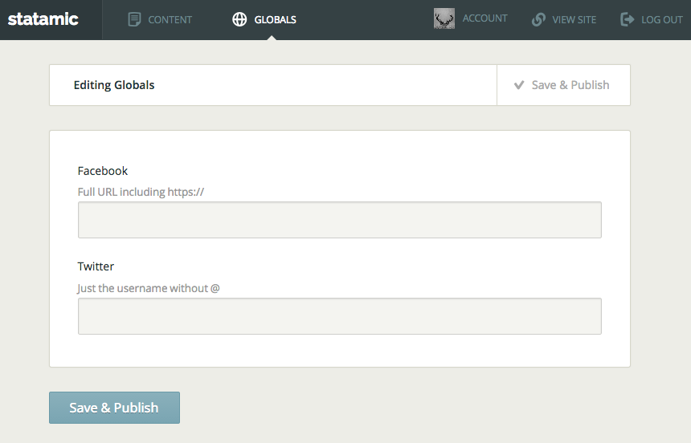

# Globals
> Simple Global Fields for Statamic



People have wanted a way to manage variables across their Statamic sites that don't fit into a particular page. These might include things like a Twitter account URL or a contact phone number.

There is a technique people use which is to create a 'globals' or 'miscellaneous' content page with these fields, then you can reference them in your templates using `{{ get_content from="/globals" }}{{ twitter_url }}{{ /get_content }}`.

This add-on exists to make the process more streamlined and simple for you and your clients.


## Installation

1. Copy `globals` into `_add-ons/`
2. Copy across `_content/__globals.md`
3. Copy across `_config/fieldsets/globals.yaml`
4. In `_config/settings.yaml`, add `globals: true` to the `_admin_nav` array


## Usage

In the control panel, the 'Globals' link in the navigation should take you to the publish page for your `_content/__globals.md` file.

In your templates, use the following to output your values:

```
{{ globals:your_var }}
```

This would be the equivalent of:

```
{{ get_content from="/globals" show_drafts="yes" }}{{ your_var }}{{ /get_content }}
```